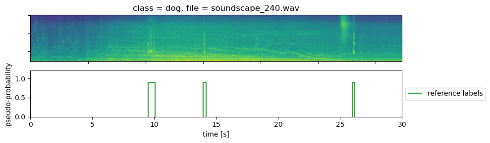

# Introduction
A description of the bioacoustics task for the advanced audio processing course at Tampere University. This is a sound event detection task, where the goal is to predict the onset and offset of bioacoustic sound events. Bioacoustics is sounds related to animals, and in this task we have three different datasets:

  1. Meerkat
  2. Dog
  3. Baby cry

These sound event classes vary a bit in characteristic. The Meerkat sounds are consistently very short, and the baby cries vary more and are longer.

The datasets are split into training and test data. The file structure is pairs of audio and annotations (<filename>.wav, <filename>.txt). Only annotations of the event class of interest are provided. E.g, in the meerkat example we have

    9.485452220875999	9.711452220876	me
    13.941618009893638	14.142618009893638	me
    25.988057036822894	26.207077870156226	me

which means that we have 3 events in this file. For all three classes we provide annotations for all onset and offset event sounds in <filename>.txt which corresponds to the audio file <filename>.wav. In these datasets there are exactly 3 events in each soundscape without overlap. However, we could make this more difficult if desired by generating new datasets using the provided generate_soundscapes.py script.

## Goal
Predict the onset and offset of the events as well as possible.

# Examples

## Meerkat dataset

An audio and annotation example is provided in 'examples/meeerkat_soundscape_15.txt', and 'examples/meeerkat_soundscape_15.wav'.

    9.485452220875999	9.711452220876	me
    13.941618009893638	14.142618009893638	me
    25.988057036822894	26.207077870156226	me

## Dog dataset

An audio and annotation example is provided in 'examples/dog_soundscape_15.txt', and 'examples/dog_soundscape_15.wav'.
    
    9.485452220875999	10.059171041737677	dog
    13.941618009893638	14.16835270377119	dog
    25.988057036822894	26.178510551562123	dog
    
## Baby cry dataset

An audio and annotation example is provided in 'examples/baby_soundscape_15.txt', and 'examples/baby_soundscape_15.wav'.

    13.941618009893638	14.352048848895906	baby
    22.138530787299455	24.224675912016007	baby
    25.988057036822894	27.37127699147142	baby

# Download the data
The three datasets have been generated using Scaper.

## Pre-generated datasets
Download using dropbox link: https://www.dropbox.com/scl/fi/28i35xxwlozzpnnmsdy2m/bioacoustics-tasks.zip?rlkey=ff68wyvuy1h1lv12nc3yqew3l&dl=0
  
    unzip bioacoustics-tasks.zip

## Generate own datasets
Students can get the source material and the code used to generate the datasets if they want to add more variability, change the SNR, or even generate a multi-label classification task.

Dowload the source material: https://www.dropbox.com/scl/fi/ay0w0lb2y2zogjh7779us/bioacoustics-sources.zip?rlkey=sxm8dpp13473a9ewi6vefw22v&dl=0

    unzip bioacoustics-sources.zip
    python generate_data.py

